# Geometric Graph Grammar ToolChain (G³)

An infrastructure and analysis foundation for **geometric grammar induction** — learning
context-free geometric graph grammars from input graphs (inverse procedural modeling) and
generating geometric structures from them (forward modeling).

The algorithm is based on:

> Marek Fiser, Bedrich Benes, Jorge Garcia Galicia, Michel Abdul-Massih, Daniel G. Aliaga,
> Vojtech Krs. **"Learning Geometric Graph Grammars."** SCCG'16, Purdue University.
> ACM DOI: [10.1145/2948628.2948635](http://dx.doi.org/10.1145/2948628.2948635)

A careful walkthrough of the algorithm (with figure analysis) lives in
[docs/ALGORITHM_NOTES.md](docs/ALGORITHM_NOTES.md). The paper itself is in [docs/paper/](docs/paper/).

## What it does

A **Geometric Graph Grammar (GGG)** encodes both *topology* and *2D/3D geometry*. Learning works
like data compression on graphs: find frequently repeated, geometrically-isomorphic subgraphs
("isogroups"), replace each occurrence with a single node, and emit a rewriting rule — repeated
hierarchically to build a compact, generative description of the input.

## Demo (2D Python)

**Forward** — apply a recursive grammar to *generate* a fractal (the paper's Fig. 12 Sierpinski
triangle); **inverse** — feed that fractal back and *induce* a grammar that recovers the recursive
**triangle hierarchy**, color-coding each occurrence.

| Forward: generate the fractal | Inverse: induce its grammar | Inverse on a grid |
|:---:|:---:|:---:|
| 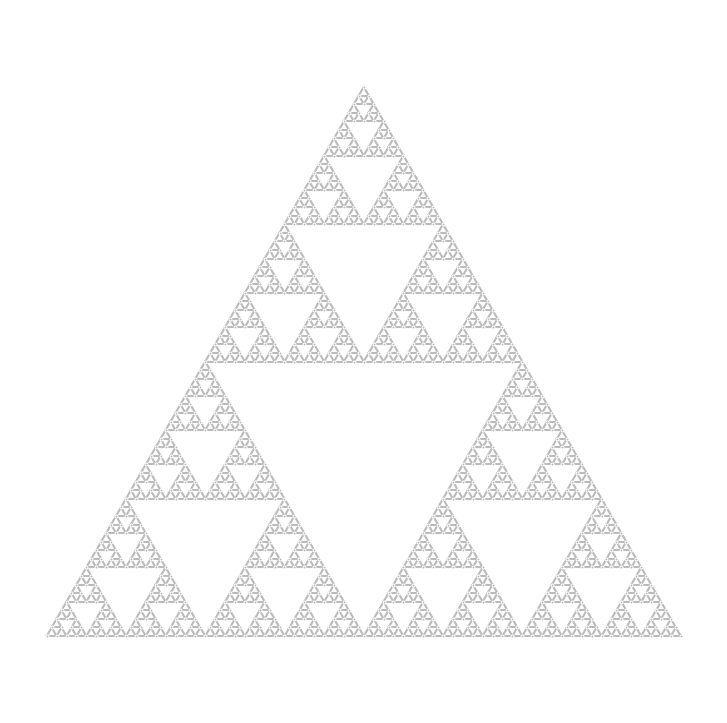 | 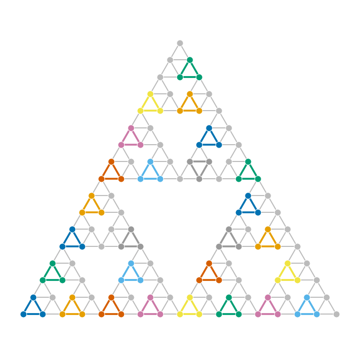 | 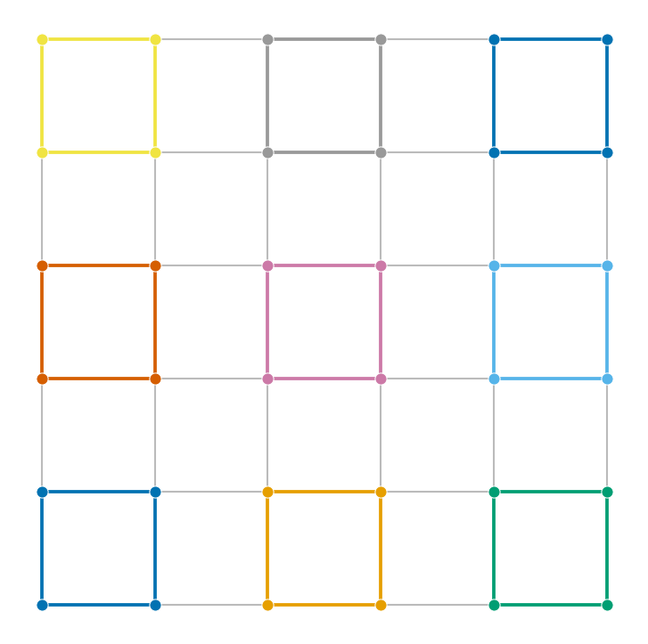 |
| `grammar → graph` | `graph → grammar` (triangles) | repeated unit squares |

```sh
cd src/g3-2d/python
pip install -e ".[dev,viz]"

# forward: generate the Sierpinski triangle
python -m g3_2d.examples sierpinski -n 6 -o sierpinski.png

# round-trip: induce a recursive triangle grammar back from a generated fractal
python -c "from g3_2d.examples import sierpinski; from g3_2d.forward import generate; \
from g3_2d.io import save_json; save_json(generate(sierpinski(),4),'sierp4.json')"
python -m g3_2d sierp4.json -o sierp4.ggg.json --draw sierp4.png --max-order 3 --prefer dense
```

The induction prints an analysis report (isogroup counts, per-rule table, compression %), writes the
grammar as `*.ggg.json` (rules `q → S / B` plus the world occurrences of each rule), and draws the
occurrences. See [src/g3-2d/python/README.md](src/g3-2d/python/README.md) for all options.

### Syntax analysis (parse a geometry against a grammar)

The recognition counterpart of learning: given a geometry **and** a grammar, reduce the geometry by
the grammar's rules step by step — recording the **derivation** (which rule fired where) — then
replay it in reverse to regenerate the geometry *exactly*.

The derivation on the depth-4 Sierpinski fractal — 123 vertices collapse to a single axiom node in
8 steps (each step colours the occurrences it reduces):

| | | |
|:---:|:---:|:---:|
| 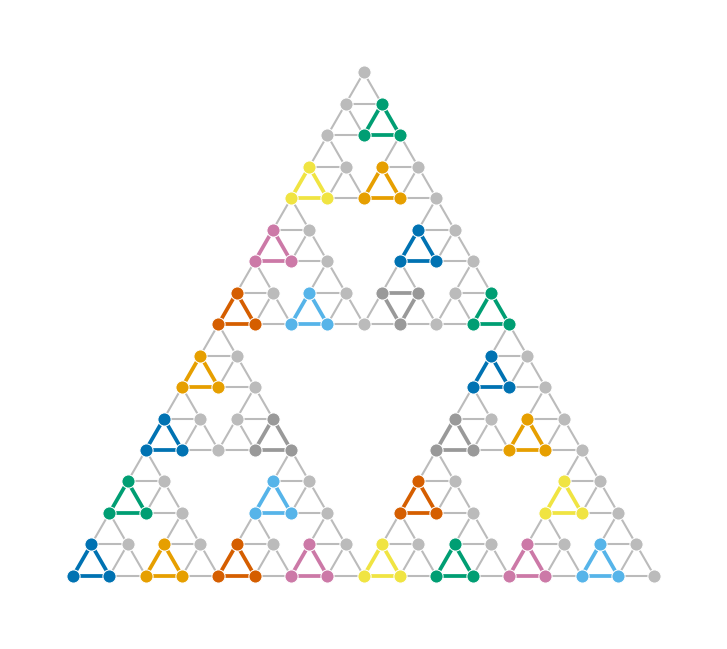 | 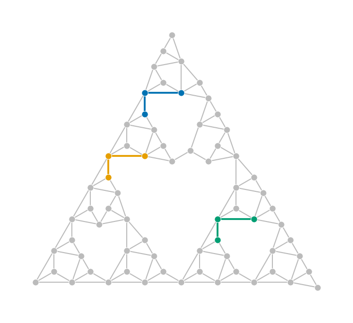 | 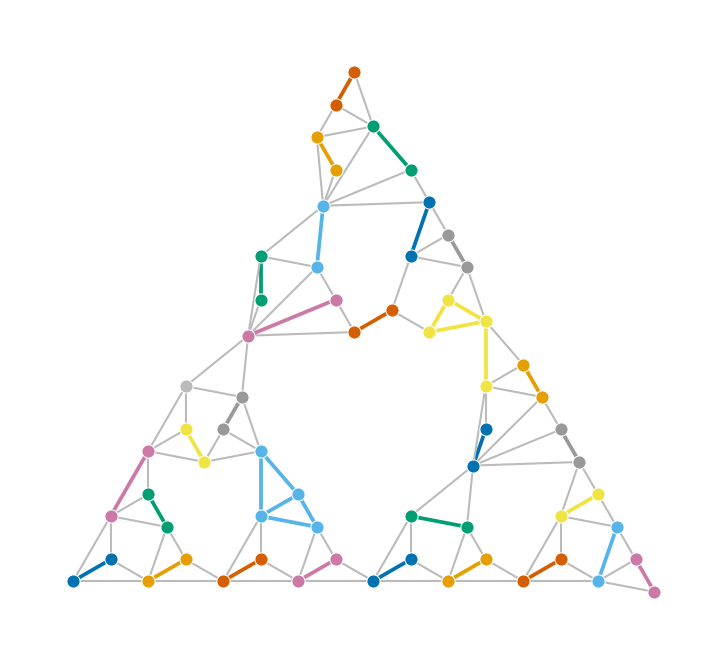 |
| step 0: 27 triangles → 69 V | step 1: → 63 V | step 2: → 32 V |
| 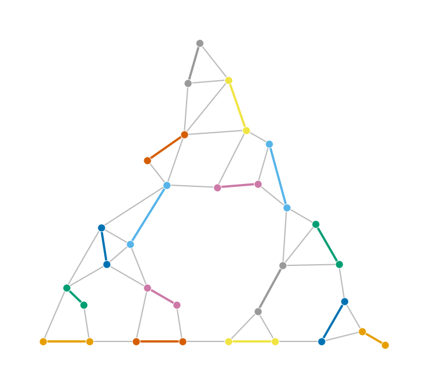 | 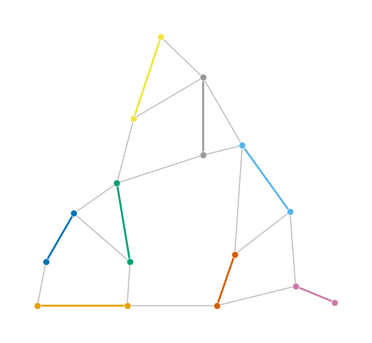 | 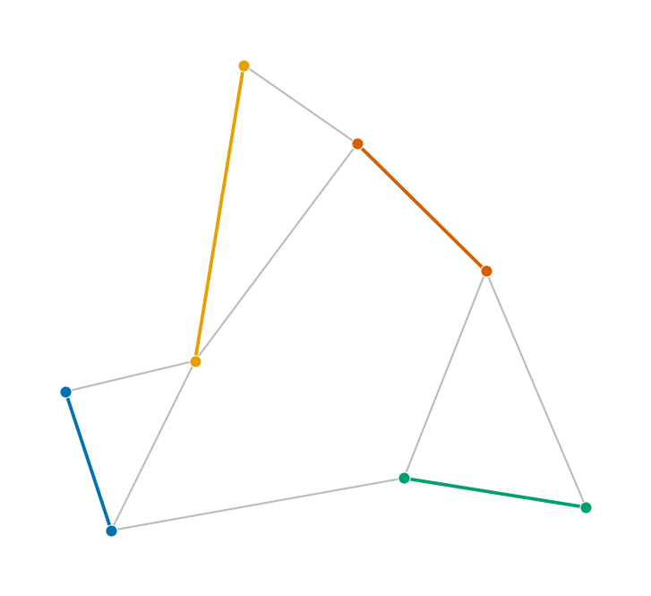 |
| step 3: → 16 V | step 4: → 8 V | step 5: → 4 V |
| 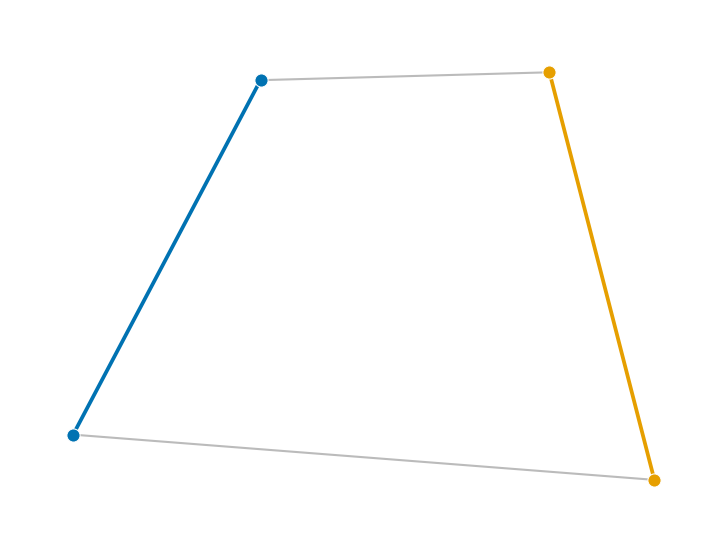 | 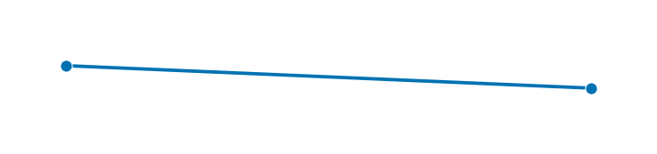 |  |
| step 6: → 2 V | step 7: → 1 V | reduced axiom (1 node) |

Replaying the derivation in reverse reconstructs the original fractal exactly (`matches input: True`).

```text
$ python -m g3_2d.parse sierp4.json sierp4.ggg.json --steps-dir steps/ --reconstruct rebuilt.png
=== syntax analysis (derivation by reduction) ===
input: 123 vertices, 243 edges
  step   0: rule 0 'R0' (order 3, level 0) reduced 27 occurrence(s); 123 -> 69 vertices
  step   1: rule 4 'R4' (order 3, level 4) reduced  3 occurrence(s);  69 -> 63 vertices
  ...
  step   7: rule 5 'R5' (order 2, level 5) reduced  1 occurrence(s);   2 ->  1 vertices
result: 8 step(s), 92 reduction(s); reduced to 1 vertex (recognized)
reconstructed 123 vertices, 243 edges (matches input: True)
```

```sh
# learn a grammar from the fractal, then analyze the fractal with it
python -c "from g3_2d.examples import sierpinski; from g3_2d.forward import generate; \
from g3_2d.io import save_json; save_json(generate(sierpinski(),4),'sierp4.json')"
python -m g3_2d sierp4.json -o sierp4.ggg.json --max-order 3 --prefer dense --quiet
python -m g3_2d.parse sierp4.json sierp4.ggg.json \
    --steps-dir steps/ --record trace.json --reconstruct rebuilt.png
```

The parser writes one PNG per reduction step (occurrences colour-coded) plus `reduced_axiom.png`,
saves the derivation as JSON (`--record`), and reconstructs the geometry, reporting whether it
matches the input.

## Real-world maps — African settlements

Ron Eglash's *African Fractals* documents the recursive, self-similar organization of indigenous
African settlements. This toolchain detects exactly that kind of repeated geometric structure, so we
can point it at a real settlement: import an OpenStreetMap road/path network, train a grammar on it,
and analyze it. The example below uses the old walled **Hausa city of Kano, Nigeria**.

### The full pipeline (fetch → train → analyze)

```sh
# 1) FETCH a real settlement from OpenStreetMap and clean it (junctions + streets)
python -m g3_2d.osm --preset kano-old-city --organic --largest-component --max-edge-factor 4 -o kano.json

# 2) TRAIN a grammar from the map (induction). Tolerance is the key knob for organic data.
python -m g3_2d kano.json -o kano.ggg.json --tolerance 0.3 --max-levels 10 --frequency-cut 0.8 --quiet

# 3) SYNTAX-ANALYZE the map with that grammar (use the SAME tolerance)
python -m g3_2d.parse kano.json kano.ggg.json --tolerance 0.3 \
    --steps-dir steps/ --node-size 8 --reconstruct rebuilt.png
```

### The map, and the analysis step by step

A ~320-junction patch of Kano (left). Syntax analysis then reduces it level by level — each step
finds occurrences of a grammar rule and merges them, roughly **halving** the map until one node
remains (`322 → 170 → 86 → 45 → 23 → 12 → 6 → 3 → 2 → 1`):

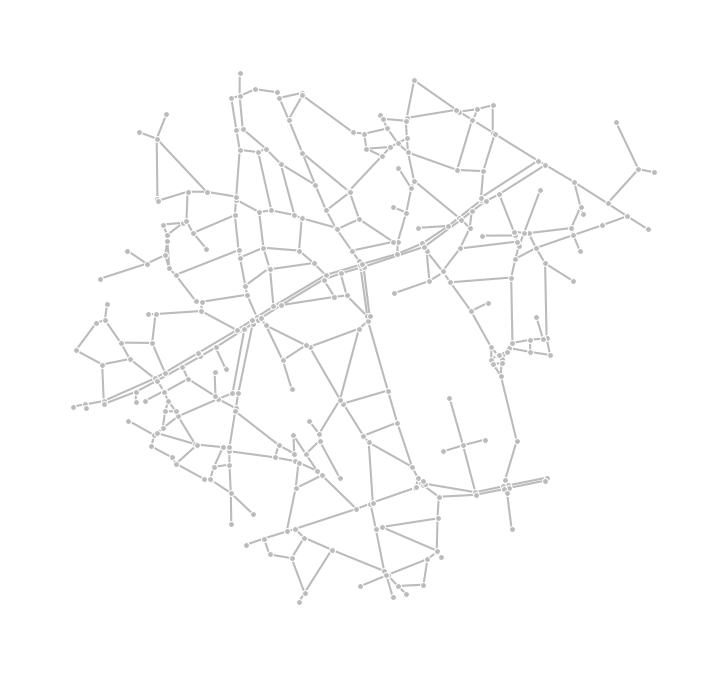

| | | |
|:---:|:---:|:---:|
| 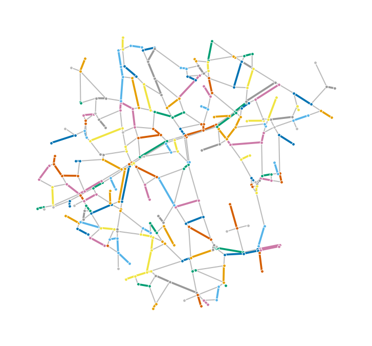 | 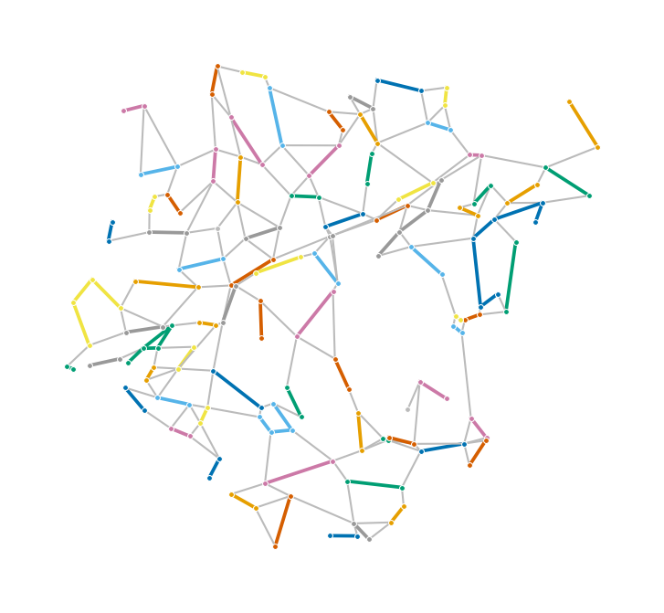 | 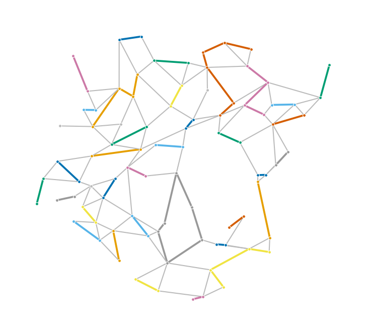 |
| step 0: 322 → 170 V | step 1: 170 → 86 V | step 2: 86 → 45 V |
| 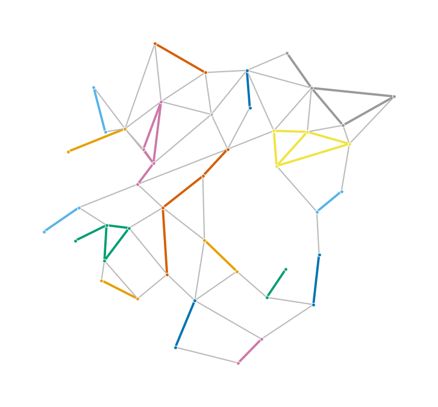 | 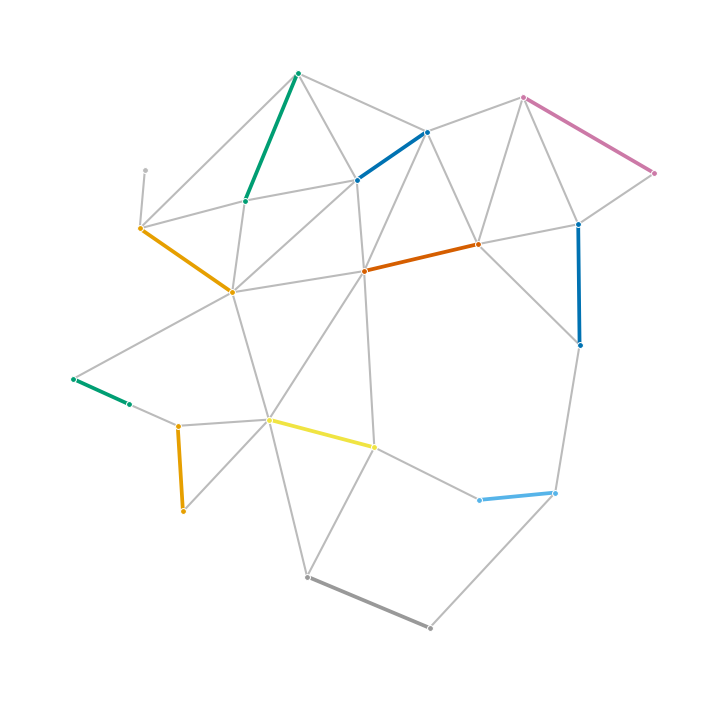 | 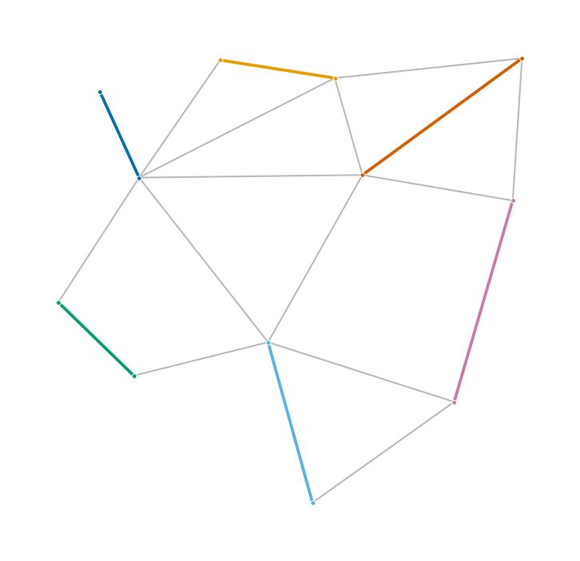 |
| step 3: 45 → 23 V | step 4: 23 → 12 V | step 5: 12 → 6 V |
| 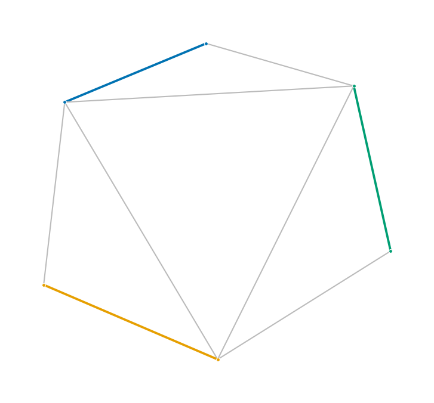 | 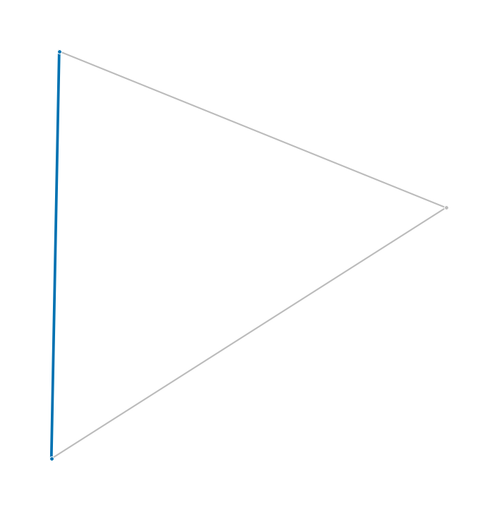 |  |
| step 6: 6 → 3 V | step 7: 3 → 2 V | reduced axiom (1 node) |

### How to read these pictures

- **Gray** is the street network at that point in the analysis: dots = junctions, lines = streets.
- **Each colour = one occurrence** of the current rule's pattern that gets **merged into a single
  node this step**. The 8-colour palette just distinguishes neighbouring occurrences — the colours
  carry no other meaning. (Here the rule is a street segment between two junctions, so each coloured
  segment is a junction-pair about to collapse to one node.)
- **Gray segments in a step are *not* reduced this step** — they overlap a chosen occurrence (you
  can't merge a junction into two nodes at once), so they wait for a later step.
- **Across steps the map gets smaller and coarser** as motifs collapse into single nodes. That
  progressive, self-similar shrinking *is* the hierarchical structure the grammar found.
- The **reduced axiom** (last tile) is what remains once the grammar has explained everything it
  can — a single node here means the whole patch was fully explained.
- **Reconstruction**: replaying the derivation in reverse rebuilds the original map *exactly*
  (`matches input: True`) — the analysis loses nothing.

### What the result says

- The grammar explains the entire patch: **322 junctions → 1 node in 9 steps** (321 merges), each
  step roughly halving the graph — a clean hierarchical, self-similar decomposition.
- **The tolerance knob is the story.** Organic streets don't repeat *exactly*; loosening the
  geometric tolerance reveals the *approximate, scale-invariant* self-similarity Eglash describes.
  On the full Kano old city the dominant 3-junction motif repeats **10× at 5% tolerance but 80× at
  30%** — the repeated structural grammar only emerges once you allow tolerance.
- Use `--prefer dense` (favour closed blocks) or `--min-order 3` (skip the trivial single-edge rule)
  to make the grammar capture larger structural motifs instead of junction-pairs; the analysis is
  then more "structural" but slower (it re-detects larger patterns each step).

> Map data © OpenStreetMap contributors (ODbL). Presets include `kano-old-city`, `fez-medina`,
> `marrakesh-medina`, `accra-jamestown`, `kumasi-centre`, plus `barcelona-eixample` and
> `manhattan-midtown`; or pass any `--bbox S W N E`.

## Time series — EEG phase-space reconstruction

A geometric graph doesn't have to be a map. A scalar **time series** becomes 2D geometry through
**phase-space reconstruction** (Takens time-delay embedding): plot each sample against a delayed
copy, `P[i] = (x[i], x[i+τ])`, and join consecutive points into a trajectory. The shape of that
trajectory is the signal's attractor — and recurring waveform patterns become recurring loops,
exactly the repeated structure the grammar detects.

We use a **real EEG channel** (PhysioNet EEG Motor Movement/Imagery DB; eyes-closed, occipital
electrode **Oz**) band-passed to **4–30 Hz** — the main brain rhythms (theta + alpha + beta), which
is more faithful than isolating a single rhythm: the attractor keeps the alpha loops *and* the finer
structure beta/theta add. The result is a 500-point 2D trajectory.

### Pipeline (EEG → PSR → preprocess → learn → analyze each step)

```sh
# 1) one EEG channel -> 2D phase-space trajectory graph (real data; --band is the preprocessing)
python -m g3_2d.eeg --channel 61 --band 4 30 --tau 4 --count 500 -o eeg.json

# 2) visualize the geometry (the attractor)
python -m g3_2d.viz eeg.json -o eeg_attractor.png --node-size 4

# 3) induce a grammar (hierarchical; --report writes the analysis)
python -m g3_2d eeg.json -o eeg.ggg.json --tolerance 0.2 --max-levels 14 --report eeg.report.json

# 4) syntax-analyze: visualize EACH step + reconstruct
python -m g3_2d.parse eeg.json eeg.ggg.json --tolerance 0.2 \
    --steps-dir steps/ --node-size 6 --reconstruct rebuilt.png --record eeg_trace.json
```
`--source synthetic` runs the whole thing offline on a generated EEG-like signal; `--band` (e.g.
`8 13` alpha, `13 30` beta), `--tau`, `--channel`, `--count`, `--start` are all tunable.

### The attractor and its recurring motif

Because our isomorphism is **scale-invariant**, loops of different amplitude are the *same* shape,
so the learner finds a recurring order-3 arc motif and color-codes its occurrences (here it repeats
**32×** across the attractor — far fewer than a pure-alpha signal would, because the broadband
trajectory is genuinely more varied):

| 2D phase-space attractor (EEG Oz, 4–30 Hz) | Learned recurring motif (32 arcs) |
|:---:|:---:|
| 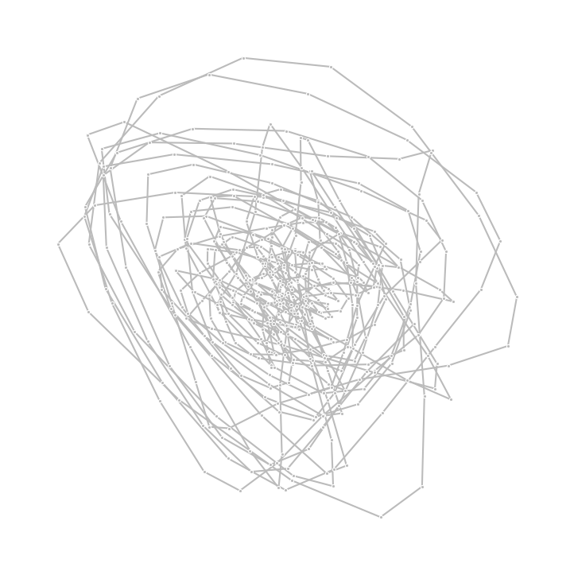 | 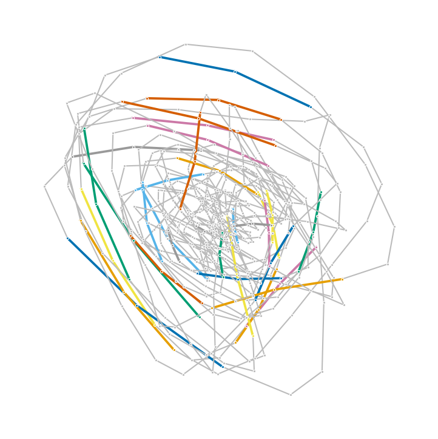 |

### Syntax analysis, step by step

The hierarchical grammar then reduces the whole 500-point trajectory to a single node in 9 steps,
roughly **halving** it each step (`500 → 250 → 125 → 63 → 32 → 16 → 8 → 4 → 2 → 1`):

| | | |
|:---:|:---:|:---:|
| 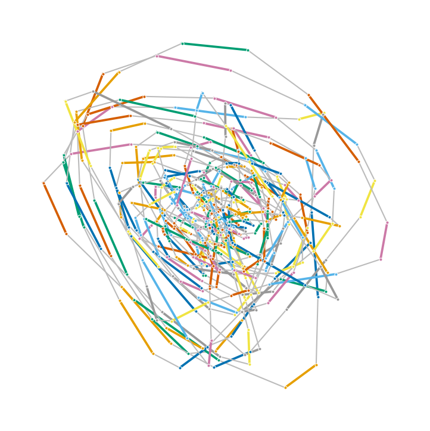 | 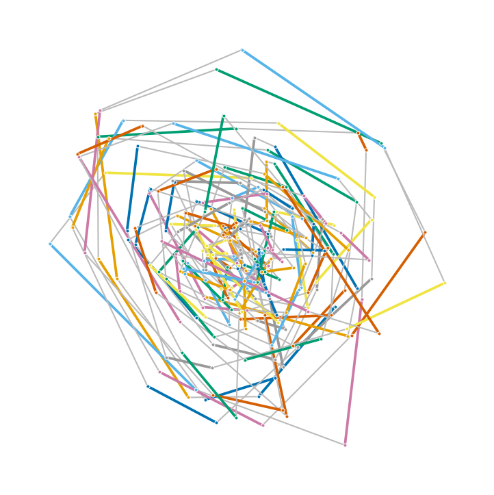 | 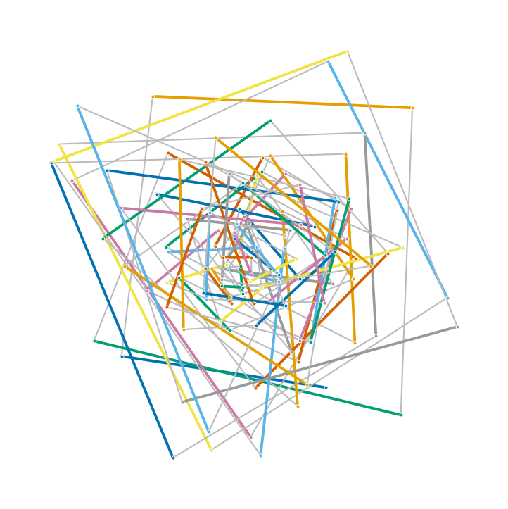 |
| step 0: 500 → 250 | step 1: 250 → 125 | step 2: 125 → 63 |
| 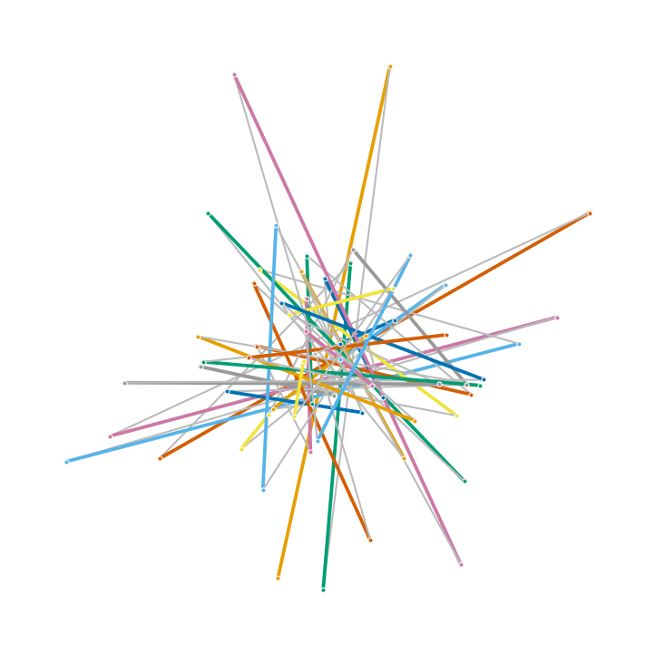 | 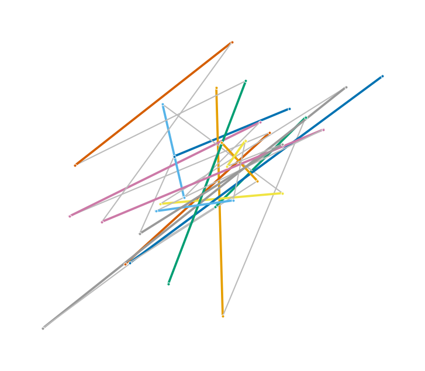 | 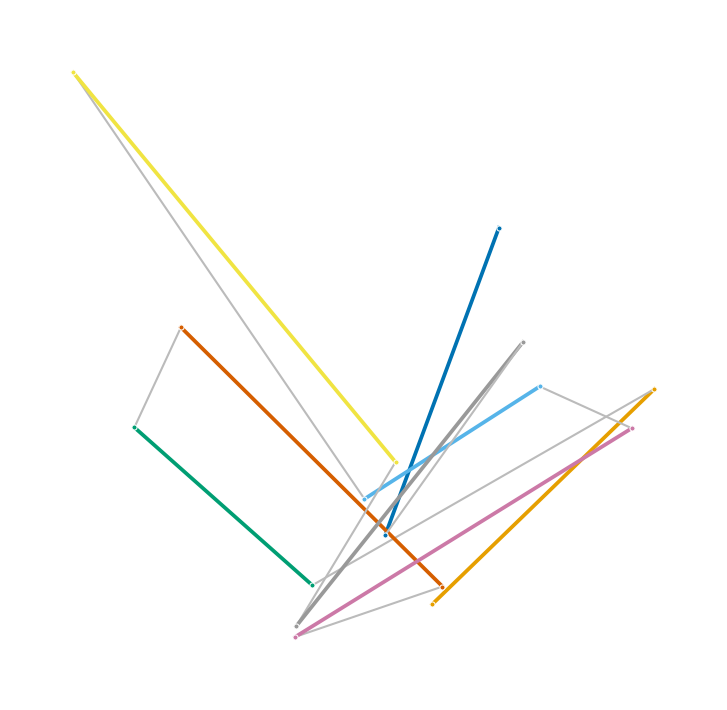 |
| step 3: 63 → 32 | step 4: 32 → 16 | step 5: 16 → 8 |
| 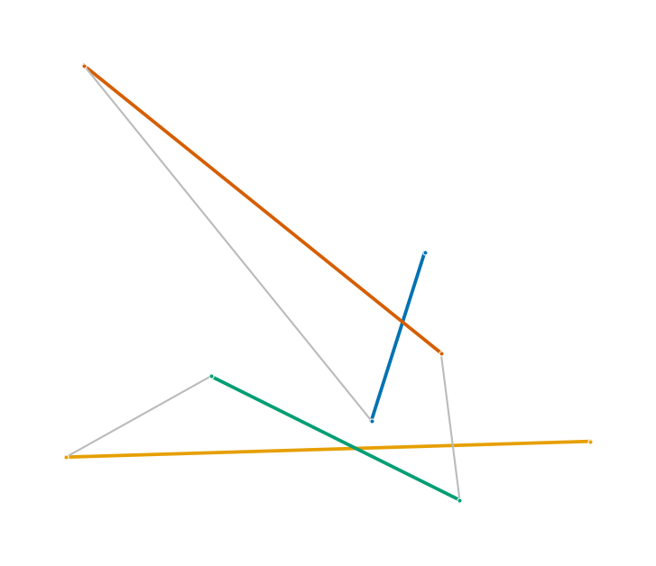 | 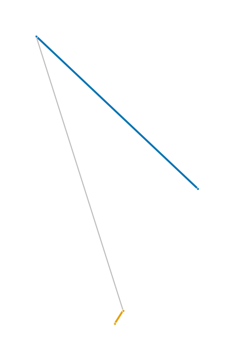 |  |
| step 6: 8 → 4 | steps 7–8: → 1 | reduced axiom (1 node) |

**How to read it** (same convention as the map demo): gray = the phase-space trajectory at that
point (dots = embedded points, lines = successive time steps); **each colour = one occurrence merged
into a single node this step**; across steps the attractor coarsens while keeping its looped shape.
Replaying the derivation reconstructs the original trajectory **exactly** (`matches input: True`).

### Notes on accuracy

- Real EEG is noisy; the `--band` preprocessing chooses *which* dynamics to embed. `4 30` keeps the
  main rhythms (used here); `8 13` isolates a clean — but trivially periodic — alpha spiral; omitting
  `--band` embeds the raw broadband signal (a dense, less interpretable attractor).
- Keep `--count` modest (~250–600) and prefer the hierarchical (edge) grammar for the step gallery:
  `parse` re-detects every step, so large trajectories or `--min-order 3` runs are much slower.

## Repository layout

```
docs/                     Paper + algorithm notes (the conceptual reference)
src/
  g3-2d/                  2D geometric graph grammars
    python/               Python implementation   ← current focus
    cpp/                  C++ implementation
  g3-3d/                  3D geometric graph grammars
    python/               Python implementation
    cpp/                  C++ implementation
LICENSE                   MIT (© Serendip Commons Society)
CONTRIBUTORS.md           Contributor list
```

There are four parallel implementations (2D/3D × Python/C++). The 2D dimension is being designed
and built first, beginning with the Python implementation; the others follow.

## Status

- **2D Python** — functional end to end: forward generation (fractals) and inverse learning
  (detection → selection → encoding → hierarchical rewriting), with analysis reports and
  visualization. See [src/g3-2d/python/README.md](src/g3-2d/python/README.md).
- **2D C++, 3D Python, 3D C++** — planned; the 2D-Python module and shared `fixtures/` are the
  specification they validate against.

## Beyond graphs — higher-dimensional grammars (planned)

A research direction takes the **2-simplex (triangle)** as the *generative primitive* and climbs
dimension by gluing (`k`-simplices → `(k+1)`-simplices), aiming at one dimension-agnostic engine, plus
a conjecture that `m`-D induction reduces to repeated 2-complex problems. It also bridges to
**simplicial physics** — spin foams are labeled 2-complexes, and production rules correspond to
Pachner moves (cf. CDT, Regge calculus, tensor models). See
[docs/ideas/higher-dimensional-grammar.md](docs/ideas/higher-dimensional-grammar.md) (plan; not yet
implemented — the paper's 1-complex algorithm is built first).

## License

[MIT](LICENSE) — Copyright © 2026 Serendip Commons Society. See [CONTRIBUTORS.md](CONTRIBUTORS.md).
